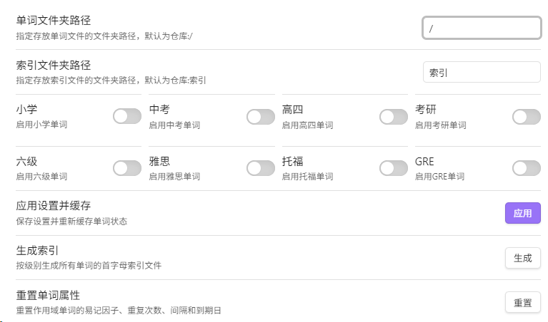
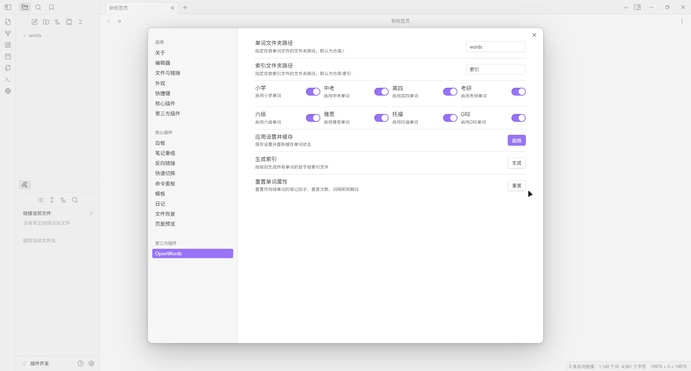
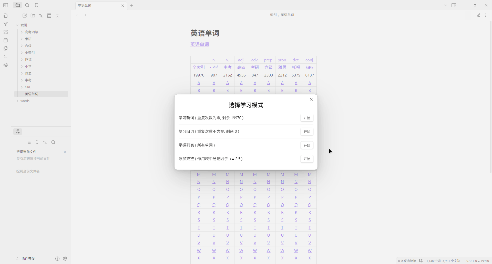
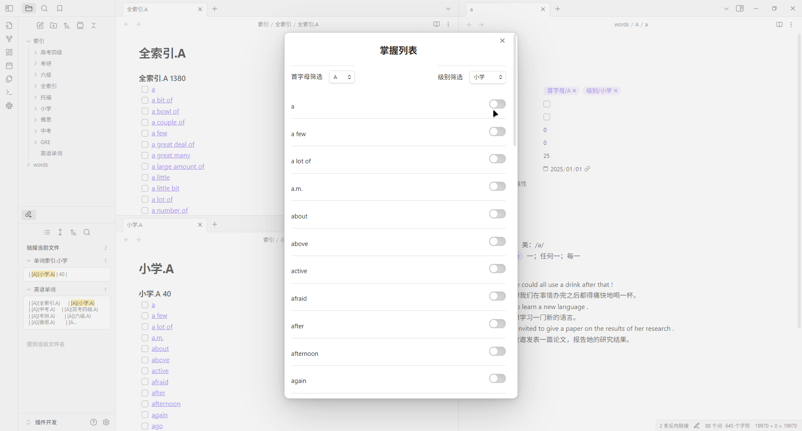
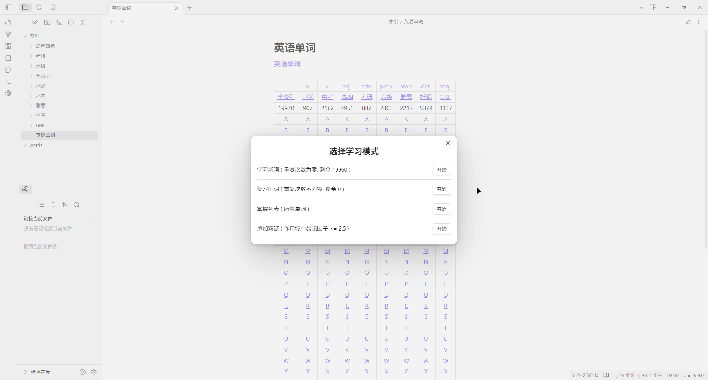
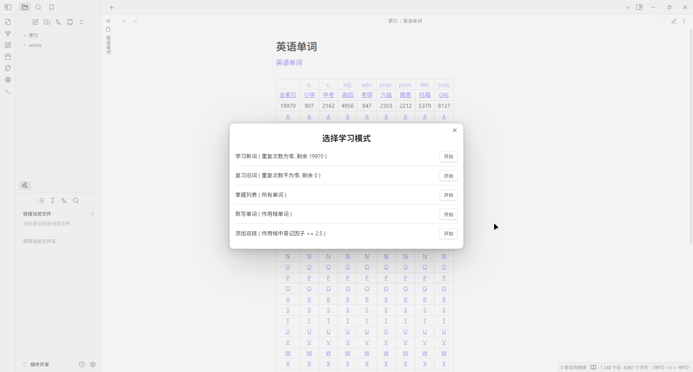
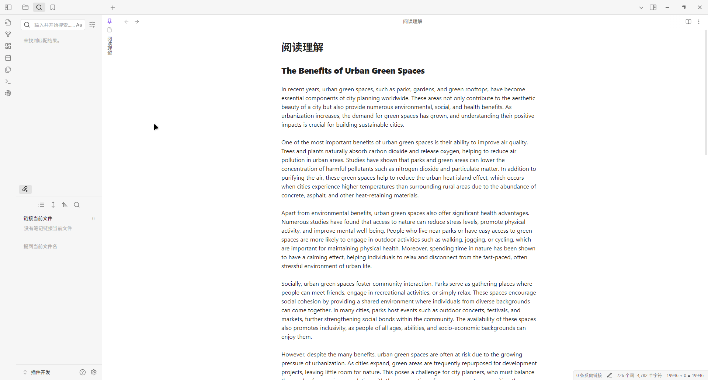

## OpenWords
- 简介
	- **OpenWords** 是一个用于背单词和单词管理的 [Obsidian](https://obsidian.md/) 简单插件, 插件入口是左侧工具栏的一个按钮加上两个命令. 使用 SuperMemo 2 间隔重复算法以及 OpenText 单词库. 依赖的第三方包主要是用于重复计算的 [supermemo](https://www.npmjs.com/package/supermemo) 和用于词形还原的 [wink-pos-tagger](https://www.npmjs.com/package/wink-pos-tagger). 本插件完全依赖单词文件及其属性, 没有表格, Json 等外部存储, 启动时会读取所有单词缓存属性, 并在更改时写入相应的单词文件, 没有设计过多的搜索功能, 可以使用内置的属性搜索单词 
		- 
- 单词
	- **单词库**以 [OpenText](opentext.net.cn) 为参考, 是 Obsidian 仓库中的一个文件夹, 其中按首字母分类储存所有单词文件, 单词即为文件名, 元数据使用文件 YAML 属性, 其中复选框和标签用于确定插件运行的作用域, 数字和日期是 SM 2 的计算参数
		- 复选框: `掌握` , 确定插件作用域, 单词被掌握意味着不会被插件处理
		- 标签: `级别/小学`, `级别/中考`, `级别/高考四级`, `级别/考研`, `级别/六级`, `级别/雅思`, `级别/托福`, `级别/GRE`, 确定插件作用域, 标签意味着当前主要精力范围, 设置中没有勾选意味着不会被插件处理
		- 数字: `重复次数`, 连续正确回答的次数, 初始值为 0
		- 数字: `间隔`, 当前到下一次复习的间隔时间, 以天为单位, 初始值为 0
		- 数字: `易记因子`, 反映记忆的难易程度, 初始值为 2.5, 插件存储为整数 250
		- 日期: `到期日`, 下一次复习的时间
- 设置
	- **插件设置**必须点击应用才能保存, 同时也会立即缓存路径中所有单词属性: 单词文件夹路径就是单词库的路径, 默认是仓库的根目录 "/" , 但并不会被运行; 索引文件夹路径就是生成索引的路径, 默认是仓库根目录下的文件夹 "索引", 如果不存在则会被创建, 详细过程参考生成索引; 而标签设置单词的作用域 
		- 
- 功能
	- 生成索引
		- 按级别生成单词库中所有单词的首字母索引文件, 在索引文件夹路径中会创建 9 个级别文件夹和 1 个总索引名文件, 其中级别文件夹又含有 26 个首字母索引文件和 1 个总索引文件, 所以一共 9×27+1=244 个文件. 无论单词有多少个, 总是固定生成这些文件. 通常单词库中增加, 减少, 重命名单词后需要重新生成索引
		- 
	- 掌握列表
		- 掌握列表能够即时快速修改单词的 `掌握` 属性, 首先将自己无比熟悉的单词设置为掌握, 例如 hello, that, my 等, 防止它们出现在后续功能中
		- 
	- 监听同步
		- 单词库是被监听的, 单词文件的属性修改会和插件缓存保持同步, 特别的索引中的复选框也会和单词文件的 `掌握` 属性同步. 手动修改和插件修改单词属性都会立即同步. 左下角状态栏实时统计当前单词属性的变化 `新词数 + 旧词数 = 作用域词数`
		- 
	- 背单词
		- 新词指重复次数为 0 的单词, 它可能是从未被学习过的, 也可能是前面学后面忘了的. 新词调度中 70% 纯随机, 30% 从易记因子和重复次数最低的 20% 中随机;  旧词指重复次数大于 0 的单词, 它是之前回答正确的. 旧词调度从已过期的单词中 70% 纯随机, 30% 从易记因子和重复次数最低的 20% 中随机. 应该尽可能的提高每个单词的重复次数和易记因子
		- 
	- 默写单词
		- 从作用域中随机抽取单词进行拼写, 目前只是一个练习功能, 不会改变更改单词的属性, 按下 `Tab` 键显示答案
		- 
	- 添加双链
		- 为当前活动页面笔记中的单词添加双链, 单词范围是作用域中易记因子小于等于 2.5 的, 所以默认属性都是添加的. 准确率在 90 %. 需要文章尽可能规范, 减少不必要的标点符号. 目前只能通过 `ctrl z` 回撤
		- 
	- 重置单词属性
		- 重置作用域单词的重复次数, 间隔, 易记因子, 到期日为默认值, 重置读写会很慢

