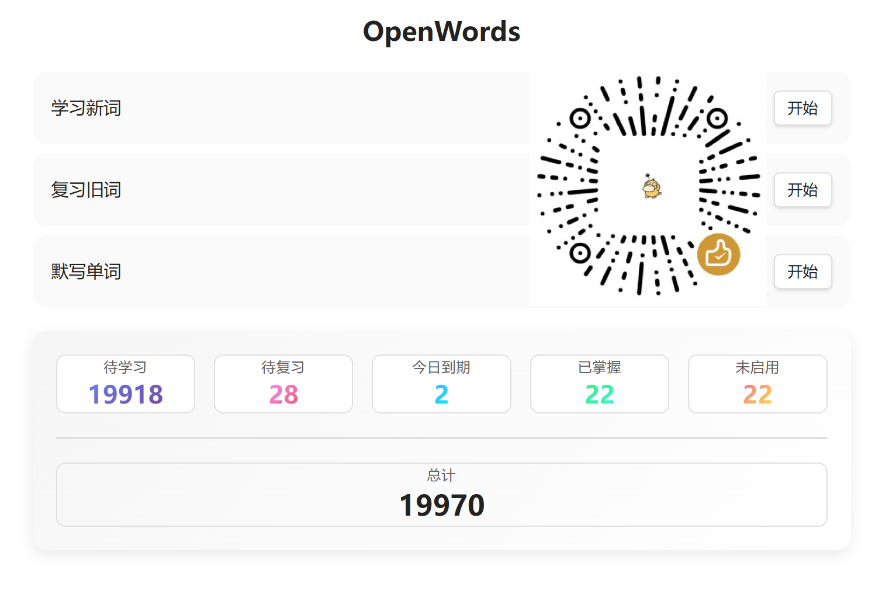
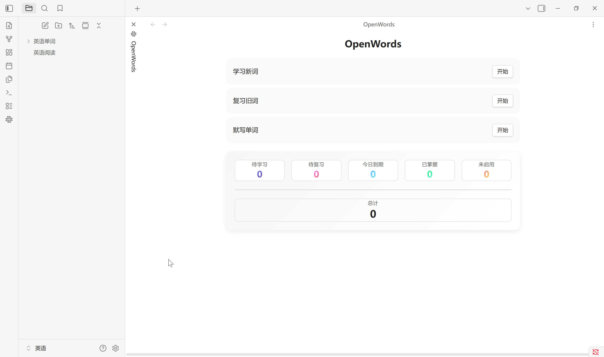
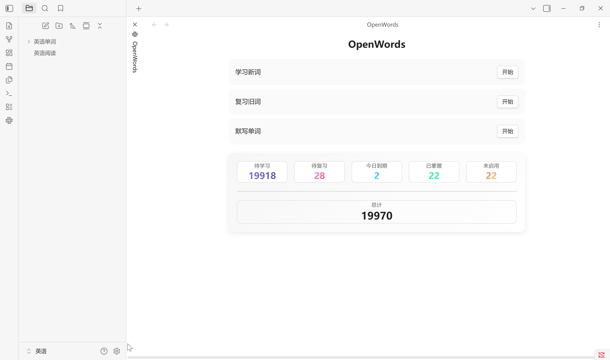
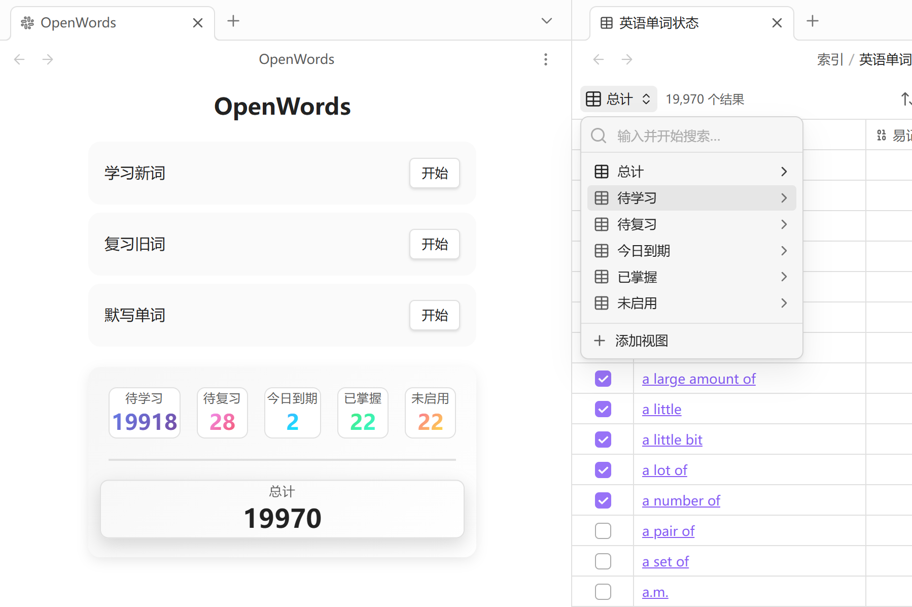
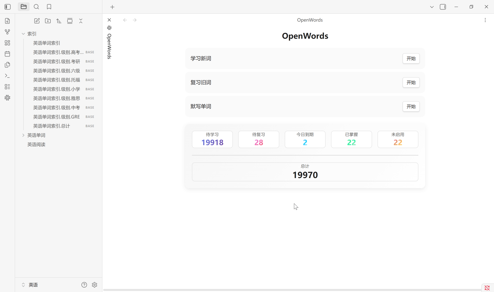
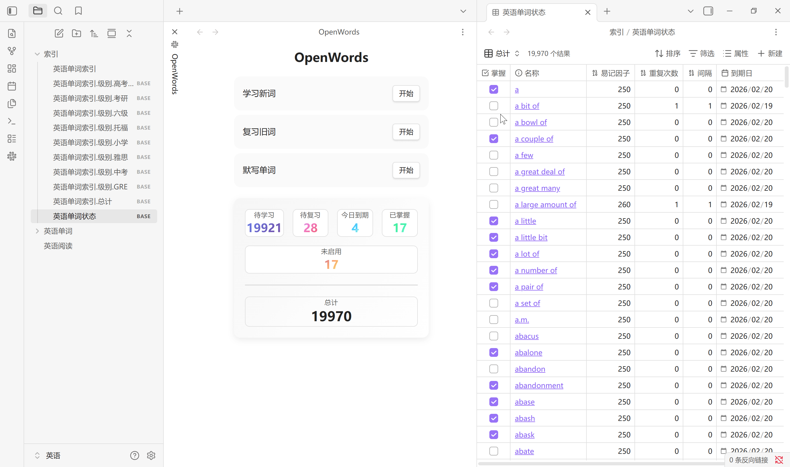
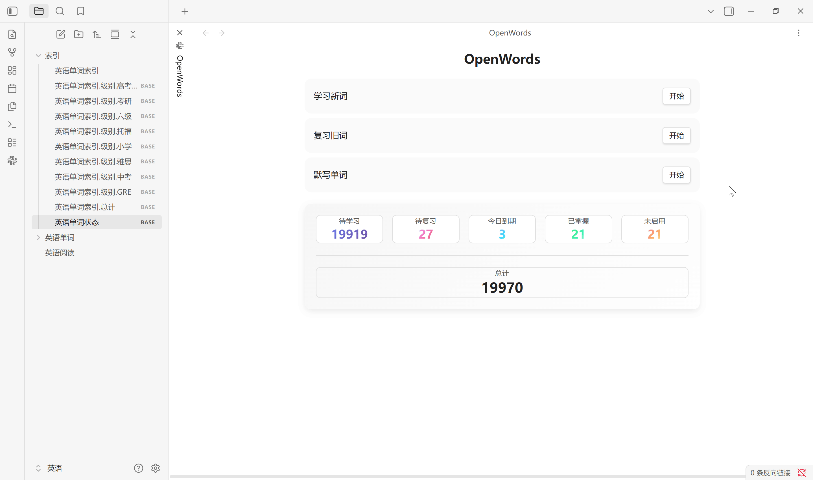
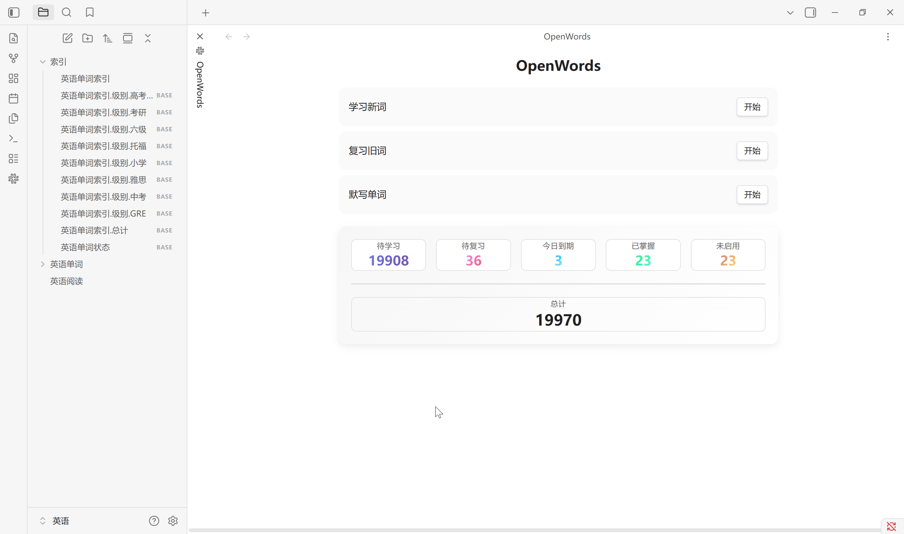
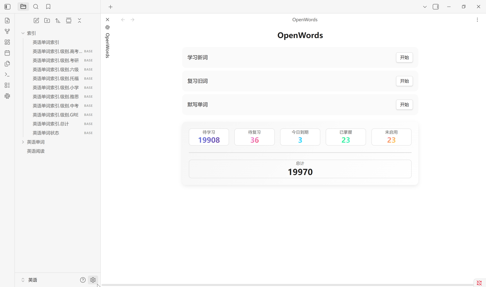

# OpenWords

**OpenWords** 是一个用于背单词和单词管理的 Obsidian 插件, 与 [OpenText](https://github.com/insile/OpenText) 单词库配套设计. 插件入口是左侧工具栏上的一个按钮再加上两个绑定命令, 主要功能有生成索引, 背单词, 默写单词, 添加双链等. 其中单词文件使用 OpenText 中的单词库, 而背单词的核心逻辑是 SuperMemo 2 间隔重复算法. 本插件完全依赖单词文件及其属性, 没有外部存储记录回答历史, 所以不能做一些记忆曲线拟合, 单词调度看起来很简单朴素, 仅依靠上次回答记录. 插件启动时会读取所有单词缓存, 更改时会即时写入相应的单词文件并更新缓存. 插件没有设计过多的搜索功能, 提倡使用 Obsidian 内置的搜索功能. 目前尚未发现 Obsidian 提供一个对 Bases 视图结果访问或者筛选的 API. 如果您认为本插件有帮助, 欢迎微信赞赏支持



## 安装

手动安装首先从本仓库 `Releases` 发布页面下载最新版本, 将 `main.js`, `manifest.json`, `styles.css` 三个文件放到新建的插件文件夹中 `{vault}/.obsidian/plugins/openwords`, 重启软件并在设置的第三方插件中启用插件. 如果您愿意协作开发, 也可以将此存储库克隆到本地开发文件夹, 安装依赖项 `npm install`, 开始编译`npm run dev`, 修改 `main.ts` 即可生成 `main.js`, 然后手动安装即可测试

## 单词

单词的格式属性及组织形式以 OpenText 中的单词库为参考基准. 单词库是仓库中的一个文件夹, 其中按首字母分类储存所有单词文件, 并且仅存储单词文件, 单词即为文件名, 元数据使用文件 YAML 属性, 其中复选框和标签用于确定插件运行的作用域, 数字和日期是 SM 2 的计算参数. 单词索引是为了更快访问的一系列 Bases 文件, 详见生成索引. 目前没有设计批量增加单词的功能, 需要手动仿照格式创建文件确定属性
- 复选框: `掌握` , 确定插件作用域, 单词被掌握意味着不会被插件处理
- 标签: `级别/小学`, `级别/中考`, `级别/高考四级`, `级别/考研`, `级别/六级`, `级别/雅思`, `级别/托福`, `级别/GRE`, 确定插件作用域, 标签意味着当前主要精力范围, 设置中没有勾选意味着不会被插件处理
- 数字: `重复次数`, 连续正确回答的次数, 初始值为 0
- 数字: `间隔`, 当前到下一次复习的间隔时间, 以天为单位, 初始值为 0
- 数字: `易记因子`, 反映记忆的难易程度, 初始值为 2.5, 插件存储为整数 250
- 日期: `到期日`, 下一次复习的时间

单词类型
- 所有单词: 单词库所有文件
- 掌握单词: 勾选掌握复选框的单词
- 启用单词: 启用标签的未掌握单词
- 新单词: 重复次数未零的启用单词
- 旧单词: 重复次数不未零的启用单词

## 设置

- 单词文件夹路径, 指单词库的路径, 默认是仓库的根目录 "/" , 但并不会被运行, OpenText 中是 `笔记/人文社科/英语/英语单词/words`; 
- 索引文件夹路径, 指生成索引的路径, 默认是仓库根目录下的文件夹 "索引", 如果不存在则会被创建, OpenText 中是 `笔记/人文社科/英语/英语单词/索引`; 
- 启用标签, 可以通过输入单词属性中的标签进行自定义筛选, 多个标签的筛选逻辑是 "或"
- 扫描单词, 路径与标签必须点击扫描才能保存, 同时插件也会立即加载路径中所有单词. Obsidian 启动后会自动运行



## 功能

### 生成索引
 
生成索引按设置中所选标签生成单词库中所有单词的首字母索引文件, 默认在索引文件夹路径中会创建 1 个 `.md` 文件以及 9 个 `.base` 文件. 其中, `.md` 文件是一个二维表, 而 `.base` 文件是标签划分的数据库视图. 无论单词有多少个, 总是固定生成这些文件. 通常单词库中增加, 删除单词后需要重新生成索引. 该索引不会自动更新, 更换单词库路径需手动生成




点击主页中的总计也会生成单词状态索引, 其中的视图与状态栏中的统计一一对应. 该单词状态索引会在点击总计, 扫描设置以及恢复默认设置中创建. Obsidian 启动时不会更新




### 监听同步

单词库是被监听的, 单词文件的属性修改会和插件缓存保持同步, 手动修改和插件修改都会立即同步. 下方状态栏实时统计当前单词属性的变化



### 背单词

背单词目标是尽可能的提高每个单词的重复次数和易记因子, 详细计算过程可查阅 SM-2 文档, 随机调度概率设置每次抽卡时随机调度的概率, 其余为优先调度概率. 默认 70 % 随机调度, 30% 优先调度. `0-5` 数字键评分, `Tab` 键显示答案
- 新词指重复次数为 0 的单词, 它可能是从未被学习过的, 也可能是前面学后面忘了的. 新词间隔只能是 0 或 1, 其中 0 是完全没有学习过的, 1 是至少学过一次的. 新词优先调度遵从间隔降序和易记因子升序, 从前 1% 中随机
- 旧词指重复次数大于 0 的单词, 它是之前回答正确的. 旧词优先调度遵从过期的易记因子和重复次数升序, 从前 1% 中随机

回答评分, 答错降低易记因子, 重复次数和间隔重置, 答对易记因子增长缓慢, 间隔逐渐延长
- 评分 0, 易记因子 -0.8
- 评分 1, 易记因子 -0.54
- 评分 2, 易记因子 -0.32
- 评分 3, 易记因子 -0.14
- 评分 4, 易记因子 -0
- 评分 5, 易记因子 +0.1



### 默写单词

默写单词是从易记因子最低的 50% 旧词中随机抽取单词进行拼写, 会影响易记因子, 按下 `Tab` 键显示答案
- 没有看答案, 直接拼写正确, 易记因子 + 0.15
- 没有看答案, 经过几次错误后拼写正确, 易记因子 + 0.05
- 看答案, 易记因子 - 0.02
- 易记因子最低不低于 1.3


### 添加双链

为当前活动页面笔记中的单词添加双链, 单词范围是作用域中易记因子小于等于设置的参数, 所以默认情况所有单词都会添加. 词形还原准确率在 90 %. 需要文章尽可能规范, 减少不必要的标点符号. 可以将参数设为 1.2 进行还原, 因为没有单词易记因子小于 1.3


### 恢复默认设置

重置所有设置选项为默认值, 请谨慎使用



### 重置单词属性

重置启用单词的重复次数, 间隔, 易记因子, 到期日为默认值, 请谨慎使用



## SuperMemo 2

```js
function supermemo(item, grade) {
    let nextInterval;
    let nextRepetition;
    let nextEfactor;

    // 回忆成绩 >= 3 表示成功记住
    if (grade >= 3) {
        if (item.repetition === 0) {
            // 第一次成功记住：间隔为 1 天
            nextInterval = 1;
            nextRepetition = 1;
        }
        else if (item.repetition === 1) {
            // 第二次：间隔为 6 天
            nextInterval = 6;
            nextRepetition = 2;
        }
        else {
            // 之后：使用前一次间隔 × 易度因子
            nextInterval = Math.round(item.interval * item.efactor);
            nextRepetition = item.repetition + 1;
        }
    } else {
        // 回忆失败：重复次数归零，间隔重置为 1 天
        nextInterval = 1;
        nextRepetition = 0;
    }

    // 更新易度因子（efactor），用 SuperMemo 原始公式调整
    nextEfactor = item.efactor + (0.1 - (5 - grade) * (0.08 + (5 - grade) * 0.02));

    // 保证 efactor 不低于 1.3（防止间隔变得太短）
    if (nextEfactor < 1.3)
        nextEfactor = 1.3;

    return {
        interval: nextInterval,
        repetition: nextRepetition,
        efactor: nextEfactor,
    };
}

```
